# HexPlayer Multi-Agent Orchestration & Workflow Guide

## 1. Executive Vision

Building and maintaining **HexPlayer (Accessible YouTube Downloader Pro)** requires deep, specialized knowledge across distinct engineering domains:
- Low-level multimedia processing (`libmpv-2.dll`, ctypes, WASAPI, FFmpeg, 10-band equalizers)
- Specialized accessible GUI engineering (wxPython, screen reader TTS, UIA, focus management)
- Reverse-engineered streaming protocols (Deno, YouTube.js InnerTube, PO Token generation, SponsorBlock, cookie decryption)
- Systems integration (Manifest V3, Stdio Native Messaging Host, Windows Registry, Inno Setup, GitHub CLI)
- Rigorous localization & headless quality gates (GNU gettext, Babel, Pytest mocks)

Instead of relying on a single generalist agent that risks omitting critical domain invariants, HexPlayer employs an **orchestrated multi-agent team**. Each agent possesses deep domain specialization, operates using proven skills, adheres to strict contracts, and undergoes rigorous automated quality gating before any work is considered complete.

---

## 2. Multi-Agent Team Architecture

```mermaid
graph TD
    Developer([Developer / User Task]) --> Orchestrator[OrchestratorAgent\nLead Coordinator & Architect]

    subgraph Core Domain Specialists
        Orchestrator -->|UI / a11y Task| UIAgent[AccessibilityUIAgent\nwxPython & Screen Readers]
        Orchestrator -->|Desktop A11y / UIA Audit| A11yAudit[DesktopA11ySpecialist\nUIA Tree & Speech Viewer]
        Orchestrator -->|Playback / MPV Task| MediaAgent[MediaPlaybackAgent\nlibmpv-2.dll & Audio Pipeline]
        Orchestrator -->|SponsorBlock Task| SBAgent[SponsorBlockSpecialist\nSegment Skipping & Filters]
        Orchestrator -->|Download / yt-dlp Task| DLAgent[DownloaderAndYtdlpAgent\nyt-dlp & FFmpeg]
        Orchestrator -->|InnerTube / Deno Task| DenoAgent[InnerTubeAndDenoAgent\nservice.js & YouTube API]
        Orchestrator -->|PO Token / 403 Task| POTAgent[PoTokenSecurityAgent\nAnti-Bot & Token Providers]
        Orchestrator -->|Cookies / Auth Task| AuthAgent[AuthCookiesSpecialist\nDPAPI Decryption & Sessions]
        Orchestrator -->|DB / State Task| StateAgent[StorageAndStateAgent\nSQLite RLock & Settings]
        Orchestrator -->|Chrome / Build Task| PackAgent[IntegrationAndPackagingAgent\nChrome Host & Inno Setup]
        Orchestrator -->|GitHub Release Task| RelAgent[GitHubReleaseManager\ngh CLI & Asset Operations]
    end

    subgraph Quality Assurance & Gatekeeper
        UIAgent --> Gatekeeper[QualityAndVerificationAgent\nPytest, Ruff & Translation Gatekeeper]
        A11yAudit --> Gatekeeper
        MediaAgent --> Gatekeeper
        SBAgent --> Gatekeeper
        DLAgent --> Gatekeeper
        DenoAgent --> Gatekeeper
        POTAgent --> Gatekeeper
        AuthAgent --> Gatekeeper
        StateAgent --> Gatekeeper
        PackAgent --> Gatekeeper
        RelAgent --> Gatekeeper
        Gatekeeper -->|Verified Green| Orchestrator
        Gatekeeper -->|Issues Flagged| Iteration[Targeted Fix Loop]
        Iteration --> Gatekeeper
    end

    Orchestrator --> Verified([Complete, Verified & PR-Ready])
```



---

## 3. Agent Role Specifications

### 1. `OrchestratorAgent` (Lead Coordinator & Architect)
- **Primary Mission**: Triage user requests, break complex features into decoupled domain tasks, dispatch to specialists, and synthesize final delivery.
- **Skills Used**: Coordinates all 17 skills; references `AGENTS.md`.

### 2. `AccessibilityUIAgent` (wxPython & Screen Reader Specialist)
- **Primary Mission**: Build, modify, and polish accessible user interfaces in `src/gui/`.
- **Skills Used**: `wx-accessible-gui`, `wxpython-architecture`, `gettext-i18n-pipeline`.
- **Invariants Enforced**:
  - `wx.CallAfter` for all cross-thread UI updates.
  - Tab traversal (`wx.TAB_TRAVERSAL`), keyboard focus restoration, and keyboard shortcuts.
  - Screen reader announcements via `speech_client.speak(msg)`.

### 3. `DesktopA11ySpecialist` (Windows Accessibility & Assistive Tech Specialist)
- **Primary Mission**: Audit Windows UI Automation (UIA) trees, Name/Role/Value/State properties, and guide manual verification with NVDA Speech Viewer.
- **Skills Used**: `desktop-a11y-specialist`, `desktop-screen-reader-testing`, `wx-accessible-gui`.

### 4. `MediaPlaybackAgent` (MPV & Audio Pipeline Specialist)
- **Primary Mission**: Maintain low-level media playback, ctypes bindings, WASAPI audio output, equalizers, and timecodes.
- **Skills Used**: `mpv-media-engine`.

### 5. `SponsorBlockSpecialist` (SponsorBlock & Content Filtering Specialist)
- **Primary Mission**: Maintain `sponsorblock-py` integration, background segment fetching, and MPV timecode cursor auto-skipping.
- **Skills Used**: `sponsorblock-engine`, `mpv-media-engine`.

### 6. `DownloaderAndYtdlpAgent` (Download & Ingestion Specialist)
- **Primary Mission**: Maintain `yt-dlp` download engine, format selectors, and FFmpeg muxing in `src/download_handler/`.
- **Skills Used**: `ytdlp-downloader-engine`, `youtube-pot-security`.

### 7. `InnerTubeAndDenoAgent` (JS Bridge & YouTube API Specialist)
- **Primary Mission**: Maintain Deno stdio JSON-RPC bridge and YouTube.js interactions in `src/service.js` and `src/deno_service.py`.
- **Skills Used**: `innertube-rpc-bridge`, `youtube-pot-security`.

### 8. `PoTokenSecurityAgent` (PO Token & Anti-Bot Specialist)
- **Primary Mission**: Maintain YouTube Proof of Origin token generation and circumvention of HTTP 403 / bot detection in `src/pot_provider_service.py`.
- **Skills Used**: `youtube-pot-security`.

### 9. `AuthCookiesSpecialist` (Browser Cookies & Authentication Specialist)
- **Primary Mission**: Maintain browser cookie extraction (Chrome, Edge, Firefox), Windows DPAPI/AES-GCM decryption, and authenticated playback sessions.
- **Skills Used**: `youtube-cookies-auth`, `ytdlp-downloader-engine`, `innertube-rpc-bridge`.

### 10. `StorageAndStateAgent` (SQLite & Settings Specialist)
- **Primary Mission**: Maintain thread-safe SQLite database (`aHexPlayer.db`), bookmarks, history, and debounced INI configuration.
- **Skills Used**: `sqlite-state-storage`.

### 11. `IntegrationAndPackagingAgent` (Browser & Release Specialist)
- **Primary Mission**: Maintain Chromium MV3 extension, native messaging host, `hexplayer://` registry association, PyInstaller compilation, and Inno Setup packaging.
- **Skills Used**: `chrome-native-messaging`, `windows-build-packaging`.

### 12. `GitHubReleaseManager` (GitHub Releases & Repository Operations Manager)
- **Primary Mission**: Manage GitHub releases, Git tags, installer binary uploads, and repository settings entirely via GitHub CLI (`gh`).
- **Skills Used**: `github-release-operations`, `windows-build-packaging`.

### 13. `QualityAndVerificationAgent` (Test & Gatekeeper Specialist)
- **Primary Mission**: Gatekeeper for all changes. Executes the preflight harness, verifies tests pass, prevents translation desynchronization, and flags regressions.
- **Skills Used**: `pytest-mocking-strategy`, `gettext-i18n-pipeline`.

---

## 4. Complete Skills Directory Index (17 Skills)

| Skill Name | Path | Primary Subsystem |
| :--- | :--- | :--- |
| `wx-accessible-gui` | `.agents/skills/wx-accessible-gui/` | Accessible wxPython GUI & screen reader speech |
| `wxpython-architecture` | `.agents/skills/wxpython-architecture/` | Sizer hierarchies, custom events, window lifecycle |
| `desktop-a11y-specialist`| `.agents/skills/desktop-a11y-specialist/`| Windows UIA, MSAA, Name/Role/Value/State, high contrast |
| `desktop-screen-reader-testing` | `.agents/skills/desktop-screen-reader-testing/` | NVDA Speech Viewer, Narrator, JAWS manual testing |
| `mpv-media-engine` | `.agents/skills/mpv-media-engine/` | `libmpv-2.dll` ctypes wrapper, WASAPI audio, equalizers |
| `sponsorblock-engine` | `.agents/skills/sponsorblock-engine/` | SponsorBlock segment auto-skipping in MPV |
| `ytdlp-downloader-engine`| `.agents/skills/ytdlp-downloader-engine/`| Dynamic `yt-dlp.zip` loader, background workers, FFmpeg |
| `innertube-rpc-bridge` | `.agents/skills/innertube-rpc-bridge/` | Deno JSON-RPC, YouTube.js, search, comments |
| `youtube-pot-security` | `.agents/skills/youtube-pot-security/` | PO Token generation, 403 circumvention, provider registry |
| `youtube-cookies-auth` | `.agents/skills/youtube-cookies-auth/` | Browser cookie extraction, DPAPI decryption, age-gate auth |
| `clipboard-url-monitor` | `.agents/skills/clipboard-url-monitor/` | Background Windows clipboard monitoring & prompt |
| `chrome-native-messaging`| `.agents/skills/chrome-native-messaging/`| Manifest V3, binary stdio host, `hexplayer://` scheme |
| `sqlite-state-storage` | `.agents/skills/sqlite-state-storage/` | Thread-safe SQLite RLock pool, atomic UPSERTs, INI |
| `gettext-i18n-pipeline` | `.agents/skills/gettext-i18n-pipeline/` | GNU gettext / Babel extraction, Arabic RTL layout |
| `pytest-mocking-strategy`| `.agents/skills/pytest-mocking-strategy/`| Headless Pytest suite with `mock_wx`, MPV doubles |
| `windows-build-packaging`| `.agents/skills/windows-build-packaging/`| PyInstaller dual targets, DLL bundling, Inno Setup |
| `github-release-operations` | `.agents/skills/github-release-operations/` | Accessible GitHub releases, asset uploads via `gh` CLI |

---

## 5. End-to-End Workflow Lifecycle & Quality Gates

Before declaring any task complete or committing changes, all agents must pass:

```powershell
uv run python scripts/agent_preflight.py
```
This executes:
1. `scripts/verify_skills.py` (Validates all 17 skills against agentskills.io format)
2. `uv run ruff check .` (Linter)
3. `uv run python scripts/check_translations.py` (Translation catalog check)
4. `uv run pytest tests/` (Unit & integration test suite)
