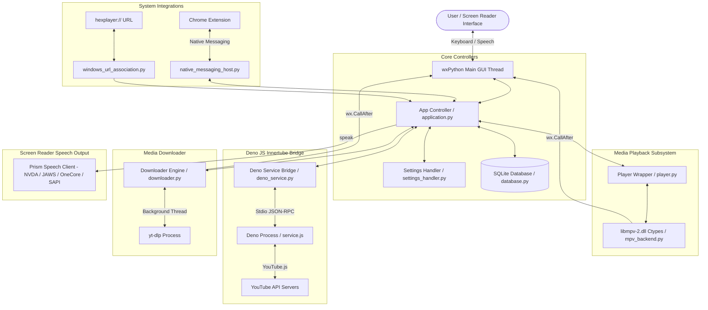

# HexPlayer (Accessible YouTube Downloader Pro) - Comprehensive Developer & AI Agent Guide

Welcome to the definitive Developer & AI Agent Guide for **HexPlayer (Accessible YouTube Downloader Pro)**. This document is a complete technical manual detailing codebase architecture, database schemas, IPC protocols, media backends, accessibility standards, internationalization pipelines, testing strategies, build machinery, and developer/AI operational playbooks.

---

## Table of Contents

1. [Executive Overview & Technology Stack](#1-executive-overview--technology-stack)
2. [Complete Directory Map & File Index](#2-complete-directory-map--file-index)
3. [System Architecture & Data Flow](#3-system-architecture--data-flow)
4. [Data Persistence & Database Specifications](#4-data-persistence--database-specifications)
5. [Deno & YouTube.js Innertube JS Bridge (RPC Protocol)](#5-deno--youtubejs-innertube-js-bridge-rpc-protocol)
6. [Media Playback Subsystem (`libmpv-2.dll`)](#6-media-playback-subsystem-libmpv-2dll)
7. [Downloader Subsystem (`yt-dlp` & Self-Healing Engine)](#7-downloader-subsystem-yt-dlp--self-healing-engine)
8. [Browser Extension & Native Messaging Host](#8-browser-extension--native-messaging-host)
9. [Accessibility (Screen Reader & Keyboard-First Architecture)](#9-accessibility-screen-reader--keyboard-first-architecture)
10. [Internationalization (i18n) Pipeline](#10-internationalization-i18n-pipeline)
11. [Development Environment & Quality Assurance](#11-development-environment--quality-assurance)
12. [Build, Bundling & Packaging Engine](#12-build-bundling--packaging-engine)
13. [Developer & AI Agent Operational Playbook](#13-developer--ai-agent-operational-playbook)

---

## 1. Executive Overview & Technology Stack

HexPlayer is a screen-reader friendly desktop application for searching, browsing, playing, and downloading YouTube content on Windows and Linux. Designed specifically for blind and visually impaired users, its interface prioritizes keyboard navigation and screen-reader feedback.

### Supported operating systems

- **Windows:** Windows 10 and 11, x64 installer.
- **Linux:** Ubuntu 24.04 amd64 (also called x86_64) is the only Linux release target. Packages are built natively on Ubuntu 24.04 against glibc 2.39; they are not universal Linux binaries and are not intended for older glibc systems. Other distributions are unverified source-development environments, not supported package targets.
- **macOS:** Unsupported. There is no macOS build or installer.
- **ARM:** No Linux ARM package is provided or promised. Linux release packaging requires native amd64/x86_64.

Linux requires a graphical desktop, system libmpv and FFmpeg, and a working desktop audio session. Frozen startup checks and automated tests do not establish full playback or screen-reader accessibility; validate these interactively on the target desktop. See [Linux installation and source setup](#linux-release-installation) below.

### Technology Stack Summary

| Subsystem | Technology / Library | Version / Detail |
| :--- | :--- | :--- |
| **Language Runtime** | Python | `>= 3.14` |
| **Dependency Manager** | `uv` | Astral UV (`uv.lock` managed) |
| **GUI Framework** | wxPython | `4.3.1` |
| **Media Engine** | libmpv | Windows `libmpv-2.dll`; Linux system `libmpv2`; ctypes wrapper (`mpv_backend.py`) |
| **JS Runtime Bridge** | Deno + YouTube.js (Innertube) | Stdio JSON-RPC bridge (`service.js`) |
| **Downloader** | `yt-dlp` | Dynamic loading / auto-updating zip |
| **Database** | SQLite 3 | Thread-safe connection pool with RLock |
| **Settings Engine** | INI / ConfigParser | Platform and portable paths resolved by `src/paths.py` |
| **Browser Integration**| Chromium Manifest V3 | Native Messaging Host + `hexplayer://` protocol |
| **Screen Reader Speech**| Prism (ethindp/prism) | `prismatoid` abstraction library (NVDA, JAWS, OneCore, SAPI) |
| **Internationalization**| GNU gettext / Babel | `2.18.0` (Arabic `ar`, English `en`) |
| **Linter & Formatter** | Ruff | `0.16.0` |
| **Testing** | Pytest + pytest-asyncio | `9.0.2` |
| **Installer Compiler** | Inno Setup | `ISCC` v6+ |

---

## 2. Complete Directory Map & File Index

```
accessible_youtube_downloader_pro/
├── pyproject.toml                     # Dependencies, pytest config, ruff lint rules
├── uv.lock                            # Pinpoint locked dependency manifest
├── justfile                           # Command runner recipes
├── BuildNPackage.bat                  # One-click Windows build and packaging script
├── DEVELOPMENT.md                     # Comprehensive developer guide (this file)
├── readme.md                          # User-facing README and feature documentation
├── PRIVACY_POLICY.md                  # User privacy and data usage policy
├── LICENSE                            # GPL v3.0 License declaration
├── HexPlayer.spec                     # PyInstaller specification
├── babel.cfg                          # Gettext extraction rules for Babel
├── messages.pot                       # Primary Gettext translation template
├── update.json / update_info.json     # Release update metadata manifests
│
├── scripts/                           # Maintenance & Build Scripts
│   ├── build.py                       # PyInstaller execution, DLL resolver, layout validator
│   └── check_translations.py          # CI script to verify messages.pot freshness
│
├── packaging/                         # Installer Packaging Assets
│   ├── windows/
│   │   └── inno.iss                   # Inno Setup Windows installer compiler script
│   └── linux/
│       ├── install-deps.sh            # APT installer for Linux compile/runtime dependencies
│       ├── control.in                 # Debian package control template (libc6 >= 2.39)
│       ├── hexplayer.desktop          # Freedesktop application menu entry
│       └── runtime_smoke.py           # Frozen Linux GTK/libmpv startup smoke check
│
├── src/                               # Main Application Source Code
│   ├── accessible_youtube_downloader_pro.py # Main entry point script
│   ├── application.py                 # Single-instance wx.App container
│   ├── async_utils.py                 # wxPython async event loop integration helpers
│   ├── database.py                    # SQLite tables (favorites, history, continue)
│   ├── settings_handler.py            # Debounced INI configuration manager
│   ├── paths.py                       # Directory path resolvers (AppData vs Portable)
│   ├── utils.py                       # General utilities, network, yt-dlp loader, i18n
│   ├── deno_service.py                # Python RPC wrapper for Deno process
│   ├── service.js                     # Deno JS script interacting with YouTube.js Innertube
│   ├── service_test.js                # Integration tests for Deno service.js script
│   ├── update_history.js              # JS utility for YouTube account watch history updates
│   ├── language_handler.py            # Translation catalog loader & gettext wrapper
│   ├── theme_handler.py               # Theme provider (System, Light, Dark, High Contrast with wxPython 4.3.0+ MSWEnableDarkMode native title bar/menu support)
│   ├── doc_handler.py                 # Local guide document loader
│   ├── runtime_dlls.py                # Verification for required binary DLL dependencies
│   ├── native_messaging_host.py       # Stdio Native Messaging host for Chrome extension
│   ├── windows_url_association.py    # Windows Registry handler for hexplayer:// protocol
│   ├── browser_extension_manager.py    # UI/System integration for unpacking browser extension
│   │
│   ├── browser_extension/             # Chromium Extension Manifest V3
│   │   ├── manifest.json              # Extension manifest & permissions
│   │   ├── background.js              # Service worker listening for context menus & clicks
│   │   ├── popup.html / popup.js      # Quick launcher extension popup UI
│   │   └── options.html / options.js  # Diagnostic & protocol testing page
│   │
│   ├── media_player/                  # Audio/Video Playback Engine
│   │   ├── player.py                  # High-level media player wrapper
│   │   ├── mpv_backend.py             # Ctypes bindings & event loops for libmpv-2.dll
│   │   ├── media_gui.py               # Playback GUI controls & screen-reader hotkeys
│   │   ├── equalizer.py               # 10-band audio equalizer controller
│   │   └── timecodes.py               # Chapter and timestamp parsing utilities
│   │
│   ├── youtube_browser/               # Search & Channel Browsing Subsystem
│   │   ├── browser.py                 # Central YouTube browsing data models
│   │   ├── search_handler.py          # Pagination & query handling
│   │   └── scraper.py                 # Fallback web scrapers
│   │
│   ├── download_handler/              # Media Download Engine
│   │   └── downloader.py              # yt-dlp execution threads & progress hooks
│   │
│   ├── gui/                           # Accessible wxPython UI Dialogs
│   │   ├── search_dialog.py           # Video/playlist/channel search dialog
│   │   ├── channel_dialog.py          # Channel tabs (Videos, Shorts, Playlists, Live, About)
│   │   ├── playlist_dialog.py         # Playlist tracks dialog
│   │   ├── comments_dialog.py         # YouTube video comments browser & poster
│   │   ├── favorites.py               # Local saved favorites dialog
│   │   ├── history.py                 # Local watch history viewer
│   │   ├── settings_dialog.py         # Comprehensive application settings modal
│   │   ├── equalizer_dialog.py        # 10-band graphic equalizer modal
│   │   ├── download_dialog.py         # Download format & quality options modal
│   │   ├── download_progress.py       # Real-time download task progress UI
│   │   ├── update_dialog.py           # App & tool update wizard
│   │   ├── update_check_dialog.py     # Background update notifier dialog
│   │   ├── auto_detect_dialog.py      # Detected clipboard YouTube link dialog
│   │   ├── activity_dialog.py         # Modal activity indicator
│   │   ├── text_viewer.py             # Accessible text viewer modal
│   │   ├── link_dlg.py                # Direct link player modal
│   │   └── custom_controls.py         # Specialized accessible controls
│   │
│   ├── docs/                          # User Guides
│   │   ├── en/guide.txt               # English text guide
│   │   └── ar/guide.txt               # Arabic text guide
│   │
│   ├── languages/                     # Gettext Language Catalogs
│   │   ├── ar/LC_MESSAGES/messages.mo # Arabic compiled binary catalog
│   │   └── en/LC_MESSAGES/messages.mo # English compiled binary catalog
│   │
│   └── speech_client.py               # Prism Speech & Screen Reader Manager
│
└── tests/                             # Pytest Suite (400+ Unit/Integration Tests)
    ├── conftest.py                    # Global fixtures (mocking Deno, MPV, wx, SQLite)
    ├── test_search_handler.py         # Search logic tests
    ├── test_downloader.py             # Download engine tests
    ├── test_comments.py               # Comment thread & posting tests
    ├── test_database.py               # SQLite queries & migration tests
    ├── test_equalizer.py              # Audio equalizer tests
    ├── test_native_messaging_host.py  # Extension IPC tests
    └── ...                            # 16 additional targeted test modules
```

---

## 3. System Architecture & Data Flow

HexPlayer follows a decoupled, event-driven architecture designed to ensure that background I/O operations (network requests, Deno RPC calls, MPV event loops, yt-dlp downloads) **never block** the wxPython main UI thread.



---

## 4. Data Persistence & Database Specifications

On Windows, settings and the database normally use `%APPDATA%\HexPlayer\settings.ini` and `%APPDATA%\HexPlayer\aHexPlayer.db`. On Linux, both live under `${XDG_DATA_HOME:-$HOME/.local/share}/HexPlayer`. Portable mode uses the application-adjacent `data` directory. Resolve these locations through `src/paths.py`, not hardcoded paths.

### A. SQLite Database Schema (`database.py`)

The database connection is managed via a thread-safe connection wrapper protected by `threading.RLock()`.

#### 1. `favorite` Table
Stores user-saved videos, playlists, or channels.
```sql
CREATE TABLE IF NOT EXISTS favorite (
    id INTEGER PRIMARY KEY AUTOINCREMENT,
    title TEXT NOT NULL,
    display_title TEXT NOT NULL,
    url TEXT NOT NULL,
    is_live INTEGER NOT NULL,
    channel_name TEXT NOT NULL,
    channel_url TEXT NOT NULL
);
```

#### 2. `continue` Table
Tracks exact playback seek positions for resuming videos across sessions.
```sql
CREATE TABLE IF NOT EXISTS continue (
    id INTEGER PRIMARY KEY AUTOINCREMENT,
    url TEXT NOT NULL UNIQUE,
    position REAL NOT NULL
);
```

#### 3. `watch_history` Table
Stores locally watched content with atomic UPSERT semantics.
```sql
CREATE TABLE IF NOT EXISTS watch_history (
    id INTEGER PRIMARY KEY AUTOINCREMENT,
    title TEXT NOT NULL,
    display_title TEXT NOT NULL,
    url TEXT NOT NULL UNIQUE,
    is_live INTEGER NOT NULL,
    channel_name TEXT NOT NULL,
    channel_url TEXT NOT NULL,
    watched_seconds REAL NOT NULL DEFAULT 0,
    last_played REAL NOT NULL
);

CREATE INDEX IF NOT EXISTS idx_watch_history_last_played
ON watch_history (last_played DESC);
```

### B. Application Settings (`settings_handler.py`)

Settings are stored in INI format. Modifications call `config_set(key, value)`, which debounces disk writes via a 2.0-second `threading.Timer`.

#### Key Configuration Parameters:
- `path`: Download destination folder (`%USERPROFILE%\downloads\HexPlayer`).
- `lang`: Interface language code (`en`, `ar`).
- `autodetect`: Automatically detect YouTube links in clipboard at startup (`True`/`False`).
- `background_monitoring`: Continuous background clipboard monitoring (`True`/`False`).
- `browser_integration`: Enables Native Messaging and URL protocol handler (`True`/`False`).
- `defaultvideoquality`: Preferred video playback quality index (0=Max, 4=720p, etc.).
- `defaultaudioquality`: Preferred audio download quality index.
- `cookiespath`: Absolute file path to YouTube Netscape cookies export (`cookies.txt`).
- `eq_enabled`, `eq_preamp`, `eq_bands`: Graphic equalizer state.

---

## 5. Deno & YouTube.js Innertube JS Bridge (RPC Protocol)

HexPlayer relies on a high-performance Deno process executing `src/service.js` to communicate with YouTube's Innertube API without breaking due to Web UI changes.

### A. Stdio RPC Protocol
The Python `deno_service.py` module spawns Deno and streams JSON objects over `stdin`/`stdout`.

#### Request Schema:
```json
{
  "id": 101,
  "command": "get_video_comments",
  "params": {
    "videoId": "dQw4w9WgXcQ",
    "sortBy": "TOP_COMMENTS",
    "cookiesPath": "C:\\Users\\user\\cookies.txt"
  }
}
```

#### Response Schema (Success):
```json
{
  "id": 101,
  "result": {
    "comments": [ ... ],
    "continuationToken": "..."
  }
}
```

#### Response Schema (Error):
```json
{
  "id": 101,
  "error": "Failed to fetch comments: Video is private"
}
```

### B. Supported RPC Commands in `service.js`:
- `get_home_feed`: Fetches home feed recommendations (requires `cookiesPath` for personalized feed).
- `get_watch_history`: Retrieves YouTube account watch history.
- `like_video`: Sends `like`, `dislike`, or `remove_like` interaction.
- `get_video_likes`: Fetches video like/dislike counts and status.
- `get_video_chapters`: Extracts timestamped video chapters.
- `get_video_comments`: Retrieves top or recent comment threads with continuation tokens.
- `get_comment_replies`: Fetches replies for a target comment thread.
- `post_video_comment`: Posts a new comment under a video.
- `get_playlist`: Fetches videos in a YouTube playlist.

---

## 6. Media Playback Subsystem (`libmpv-2.dll`)

Playback is powered by MPV via Ctypes in `src/media_player/mpv_backend.py`.

### Critical Architecture Rules for MPV:
1. **Thread Synchronization:** MPV callbacks execute on native C background threads. **NEVER** update wxPython UI elements directly inside an MPV callback. Always wrap UI updates in `wx.CallAfter()`.
2. **Audio Output Device Routing:** Audio output device switching (`F12`) routes directly through MPV's `audio-device` property.
3. **Equalizer Filter:** The 10-band equalizer manipulates MPV's `af` (audio filter) string property using the `equalizer` filter specifier (`equalizer=f=31.25:g=0:f=62.5:g=0...`).

---

## 7. Downloader Subsystem (`yt-dlp` & Self-Healing Engine)

Media downloads are managed by `src/download_handler/downloader.py`.

### A. Dynamic Loader & Self-Healing (`src/utils.py`)
To ensure reliable operation without breaking when YouTube updates its player code:
1. `load_yt_dlp()` dynamically imports `yt_dlp` from `%APPDATA%\HexPlayer\yt_dlp.zip` or local project fallbacks.
2. If `yt-dlp` throws import errors or corrupt archive exceptions, `_discard_bad_yt_dlp()` automatically purges the corrupted file and downloads a fresh build directly from official repositories.
3. `update_youtubei()` updates YouTube.js versions dynamically via Deno cache reload.

### B. Download Quality Selection (`pick_best_format`)
Format resolution matches user preferences (`defaultvideoquality`, target resolution 1080p, 720p, 480p, etc.) while falling back gracefully to available streams.

---

## 8. Browser Extension & Native Messaging Host

HexPlayer includes a Chromium Manifest V3 extension located at `src/browser_extension/`.

### A. Communication Architecture
- **Native Messaging Host:** Spawns `HexPlayerNativeHost.exe` (`src/native_messaging_host.py`).
- **Stdio Framing:** Messages use Chromium standard 4-byte little-endian uint32 message length headers followed by UTF-8 encoded JSON.
- **Protocol Fallback:** If Native Messaging Host is unavailable, the extension automatically invokes `hexplayer://play?url=...` or `hexplayer://download?url=...`.

---

## 9. Accessibility (Screen Reader & Keyboard-First Architecture)

Accessibility is the foundational requirement of HexPlayer. Code that breaks keyboard navigation or screen reader output is considered a **critical bug**.

### Mandatory Accessibility Guidelines:

1. **Native Controls:** Use standard `wx.ListBox`, `wx.Button`, `wx.TextCtrl`, and `wx.Menu`. Avoid custom owner-drawn or mouse-only widgets.
2. **Accessible Labels & Mnemonics:**
   - Always assign labels to controls using `wx.StaticText` or `SetLabel()`.
   - Provide keyboard mnemonics (e.g. `&Search`, `&Download`) so `Alt + Key` navigates directly to controls.
3. **Tab Navigation Order:** Explicitly specify tab traversal order for modal dialogs.
4. **Speech Output (`speak()`):**
   - Call `speak(message)` from `speech_client` whenever asynchronous actions take place.
   - `speak()` uses Prism (`prismatoid`) to route announcements to active screen readers (NVDA, JAWS, etc.) or TTS engines (OneCore, SAPI).
5. **Keyboard Shortcuts:**
   - `Ctrl + F`: Focus Search
   - `Ctrl + D`: Download dialog
   - `Ctrl + Y`: Open link dialog
   - `Ctrl + H`: History
   - `Ctrl + Shift + F`: Favorites
   - `Space`: Pause/Play
   - `Arrow Keys`: Volume and seeking

---

## 10. Internationalization (i18n) Pipeline

All translatable strings are managed via GNU gettext.

### Developer Workflow:
1. Mark strings in code:
   ```python
   from language_handler import _

   msg = _("Download completed successfully.")
   ```
2. Extract strings into `messages.pot`:
   ```powershell
   uv run pybabel extract -F babel.cfg -k _ -o messages.pot .
   ```
3. Validate string catalog in CI:
   ```powershell
   uv run python scripts/check_translations.py
   ```
4. Compile binary `.mo` catalogs:
   ```powershell
   uv run pybabel compile -d src/languages
   ```

### Windows Region & Geolocation Detection:
To provide relevant search results, trending feeds, and regional recommendations matching the user's system location without hardcoding countries or defaulting to `US`:
1. `utils.get_windows_region()` queries the Windows API (`ctypes.windll.kernel32.GetUserDefaultGeoName`), registry (`HKCU\Control Panel\International\Geo\Name`), or system LCID locale to obtain the 2-letter ISO 3166-1 country code (e.g., `US`, `SA`, `EG`, `LY`, `GB`, `FR`, `DE`).
2. `youtube_browser/search_handler.py` passes `region=utils.get_windows_region()` and `language=config_get("lang")` to `py_yt` (`VideosSearch`, `PlaylistsSearch`, `ChannelsSearch`). In `py_yt`, these map directly to YouTube's `gl` (geolocation) and `hl` (host language) InnerTube API parameters.
3. `service.js` (Deno JS bridge) receives `location` in command parameters and initializes `Innertube` via `Innertube.create({ location: ... })`.

---

## 11. Development Environment & Quality Assurance

### Windows source setup

Install uv, clone the repository, and install the Python version selected by `.python-version` and the locked dependencies:

```powershell
winget install astral-sh.uv
git clone https://github.com/makhlwf/accessible_youtube_downloader_pro.git
cd accessible_youtube_downloader_pro
uv python install
uv sync --locked
uv run --no-sync python src\accessible_youtube_downloader_pro.py
```

### Linux release installation

Check the [HexPlayer releases and assets](https://github.com/makhlwf/accessible_youtube_downloader_pro/releases). Linux assets are not available until a release containing them is published. If the chosen release has no Linux assets, use the source setup below instead of the Windows executable.

For Ubuntu 24.04 amd64/x86_64, a published release contains `HexPlayer-VERSION-linux-amd64.deb`, `HexPlayer-VERSION-linux-x86_64.tar.gz`, and a matching `.sha256` file for each. Replace `VERSION` below with the downloaded release version and run commands in the download directory. Download the matching checksum beside the package and verify it before installation.

The Debian package installs into `/opt/hexplayer`, adds desktop integration, and provides the `hexplayer` command. APT installs its declared runtime dependencies:

```bash
sha256sum --check HexPlayer-VERSION-linux-amd64.deb.sha256
sudo apt install ./HexPlayer-VERSION-linux-amd64.deb
hexplayer
```

Alternatively, install the system runtime dependencies and extract the archive into a user-writable directory. Keep the entire `HexPlayer` directory together, including `_internal`; the archive does not install system dependencies or a desktop launcher:

```bash
sudo apt update
sudo apt install libstdc++6 libgtk-3-0t64 libmpv2 ffmpeg libnotify4 \
    libsecret-1-0 libwebkit2gtk-4.1-0 libgl1 libglu1-mesa libsm6 libxtst6 \
    libspeechd2 speech-dispatcher xdg-utils espeak-ng xclip wl-clipboard
sha256sum --check HexPlayer-VERSION-linux-x86_64.tar.gz.sha256
tar -xzf HexPlayer-VERSION-linux-x86_64.tar.gz
./HexPlayer/HexPlayer
```

Launch as your normal desktop user, not with `sudo`. Enable Orca in your desktop accessibility settings and ensure Speech Dispatcher and desktop audio work before evaluating speech. X11 clipboard helpers and `wl-clipboard` are supplied for their respective sessions; test clipboard and focus behavior in the session you actually use.

Startup dependency checks can offer to download Deno and yt-dlp and prepare JavaScript dependencies; allow network access and complete these prompts. Linux uses system libmpv, `ffmpeg`, and `ffprobe`, not Windows DLLs or `.exe` files. By default, settings, the database, logs, and downloaded tools live under `${XDG_DATA_HOME:-$HOME/.local/share}/HexPlayer`. A `portable.dat` marker beside the application selects a sibling `data` directory instead; that location must be writable.

### Native Linux source and development setup

Use a native Ubuntu 24.04 amd64 desktop or VM, not the Windows virtual environment or a cross-build. Install Git and curl, install uv using its installer, then open a new terminal if `uv` is not yet on `PATH`:

```bash
sudo apt update
sudo apt install git curl
curl -LsSf https://astral.sh/uv/install.sh | sh
```

Clone the source and run the repository's dependency installer before syncing Python packages:

```bash
git clone https://github.com/makhlwf/accessible_youtube_downloader_pro.git
cd accessible_youtube_downloader_pro
sudo bash packaging/linux/install-deps.sh
export UV_CONCURRENT_BUILDS=1
uv python install
uv sync --locked
uv run --no-sync python src/accessible_youtube_downloader_pro.py
```

`packaging/linux/install-deps.sh` uses APT to install the C/C++ toolchain, GTK 3 and WebKitGTK 4.1 development headers, graphics/image/media libraries, libffi and libsecret headers, system libmpv and FFmpeg, Speech Dispatcher, clipboard helpers, D-Bus, and Xvfb. wxPython may compile from source for the selected Python version; installing only `libgtk-3-0t64` or Ubuntu's `python3-wxgtk4.0` does not satisfy this uv environment. Keep `UV_CONCURRENT_BUILDS=1` set to limit simultaneous package builds, and allow substantial time and memory for the GTK build. `uv python install` follows `.python-version`; Ubuntu's default Python is not a substitute for the project's Python 3.14+ requirement.

### Tests and preflight

From the repository root after syncing development dependencies, run these Linux commands, matching `.github/workflows/tests.yml`:

```bash
xvfb-run -a uv run --no-sync python -c "import wx, prism; app = wx.App(False); print(wx.version())"
dbus-run-session -- xvfb-run -a uv run --no-sync pytest tests/
uv run --no-sync ruff check .
dbus-run-session -- xvfb-run -a uv run python scripts/agent_preflight.py
```

On Windows, run:

```powershell
uv run --no-sync pytest tests/
uv run python scripts/agent_preflight.py
```

Preflight validates skills, runs Ruff, checks translation catalogs, and runs the full test suite. D-Bus and Xvfb provide an isolated session and virtual display for Linux automated checks; they are not the recommended way to run the interactive application. Test keyboard navigation, focus restoration, Orca announcements, Speech Dispatcher output, real audio/video playback, downloads, and browser handoff separately in a real desktop session. Record the desktop, X11 or Wayland session, screen reader, and audio setup with results.

---

## 12. Build, Bundling & Packaging Engine

Standalone executable packaging is managed by `scripts/build.py`. Builds are native to the host OS; Windows builds do not produce Linux packages.

### Native Ubuntu 24.04 amd64 build

After the Linux system dependency installation above, run from the repository root:

```bash
export UV_CONCURRENT_BUILDS=1
uv python install
uv sync --locked --group build
xvfb-run -a uv run --no-sync python scripts/build.py
```

**The build deletes the repository's existing `build/` and `dist/` directories before running PyInstaller. Save any artifacts you need elsewhere first.** The script verifies system libmpv, FFmpeg, FFprobe, and `dpkg-deb`, builds the main executable and native messaging host, validates the layout, then creates:

- `dist/HexPlayer/HexPlayer` and `dist/HexPlayer/HexPlayerNativeHost`, with their shared `_internal` directory.
- `dist/HexPlayer-VERSION-linux-x86_64.tar.gz`.
- `dist/HexPlayer-VERSION-linux-amd64.deb`.
- A matching `.sha256` file for each package.

`VERSION` comes from `pyproject.toml`. Release CI uses `uv sync --locked --no-dev --group build`; local development keeps the dev group so tests and preflight remain available. CI runs on Ubuntu 24.04 x86_64, and the Debian package requires glibc 2.39 or newer. This is not a compatibility guarantee for other distributions or architectures.

Check the frozen output and packages:

```bash
timeout 45s dbus-run-session -- xvfb-run -a dist/HexPlayer/HexPlayer --packaging-smoke-test
desktop-file-validate packaging/linux/hexplayer.desktop
dpkg-deb --info dist/*.deb
(cd dist && sha256sum --check ./*.sha256)
```

The frozen smoke test checks Linux dependency imports, a GTK window opening and closing, and system libmpv initialization with null audio/video outputs. It does not run the full application workflow, play media, or verify screen-reader speech and keyboard usability. The build workflow additionally checks native-host message framing. Perform the real-desktop accessibility and playback checks described above before release; neither a passing smoke test nor unit tests replace them.

`.github/workflows/build-artifacts.yml` produces native Windows and Linux artifacts. `.github/workflows/release.yml` publishes both platforms together only after their builds succeed; a local build does not make Linux downloads available on the release page.

### Windows build operations:
1. **DLL Verification:** Ensures `libmpv-2.dll` (extracted from `libmpv-2.dll.zip`), `ffmpeg.exe`, and `ffprobe.exe` are present in `src/`.
2. **System DLL Inclusion:** Resolves system binary dependencies such as `vulkan-1.dll` from `System32` or system `PATH`.
3. **PyInstaller Execution:** Compiles main app (`HexPlayer.exe`) and native messaging host (`HexPlayerNativeHost.exe`).
4. **Installer Compilation:** Executes Inno Setup (`iscc packaging\windows\inno.iss`) via `./BuildNPackage.bat`.

---

## 13. Developer & AI Agent Operational Playbook

### Rules for AI Coding Agents:
1. **Never mutate file paths blindly:** Always use `paths.py` functions (`settings_path`, `get_app_path()`).
2. **Preserve `wx.CallAfter`:** Any background thread updating the UI must use `wx.CallAfter`.
3. **Verify before reporting completion:** Run `uv run python scripts/agent_preflight.py`; on headless Linux, wrap it with `dbus-run-session -- xvfb-run -a` as shown above.
4. **Update `messages.pot` on UI text changes:** If user-visible strings are added or edited, run `check_translations.py`.
5. **Enforce Screen Reader Accessibility:** Ensure new controls have proper keyboard hooks, tab stops, and speech announcements.
